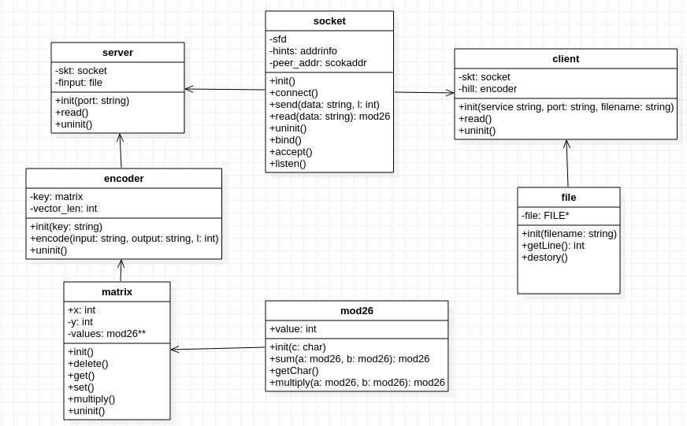

# TP1 - Hill Cipher

Pablo Salvador Dimartino - 101231

Taller de Programación I (75.42) - 1º Cuatrimestre 2021

Facultad de Ingeniería

Universidad de Buenos Aires

[Link al repositorio de GitHub](https://github.com/psdimartino/TallerDeProgramacion_TP1)

## Introduccion

Para la resolucion del problema se orientó la estructura del código para permitir una compartimentalización. Estas estructuras son mas facilmente testeables y hacen que el código sea mas entendible y mantenible.

## Estructura general

Los elementos principales del código, el `Server` y el `Client` se encargan de orquestar las relaciones entre los TDAs:

1. `file`: Se encarga de la apertura, lectura linea por linea y cierre (si corresponde) del flujo de entrada.
2. `sockets`: Se encargan de el envío y recepcion de mensajes a travez del protocolo TCP.
    Para el envío de los bytes de dimensión del array de fomra correcta, se convierte l a big endian, y se lo convierte a un arreglo de elementos de 1 byte. 
3. `encoder`: Realiza la conversión entre strings y caracteres. Para dicha conversión utiliza dos TDAs:
    a. `mod26`: Es una abstracción que permite la aritmética modular entre los caracteres. Encapsula los caracteres validos para la codificacón con sus operaciones correspondientes.
    b. `matrix`: Contiene principalmente una implementación de los algoritmos de multiplicacion de matrices de valores `mod26`.

Se pueden ilustrar dichas relaciones mediante el gráfico:

## Uso del Heap y stack

Se decidó no utilizar memoria dinamica en niguna instancia. Esto es debido a que todas la dimensiones de la memoria de las distintas variables tienen un limite conocido.

Por enunciado s elimita a los keys a un largo de 16 caracteres, entonces el máximo tamaño posible de una matriz es 4x4.

Al enviar datos, se utilizan 2 bytes para definir el largo del string. El mayor numero que 2 bytes pueden definir sin utilizar bit de signo es 2^16 - 1 = 65535. Entonces el mayor alrgo de un string es de 65535 caracteres, lo equivalente a menos de 66 kb. De forma arbitraria se define este número como suficientemente pequeño como para declarar el tamaño de su memoria de manera estática.

Una exepción conocida a esta decisión es el uso de *heap* por parte de la función `getaddrinfo()`. Como esta documentado en su [manpage](https://man7.org/linux/man-pages/man3/getaddrinfo.3.html), dicha función alloca memoria y es necesario liberarla con `freeaddrinfo()`.